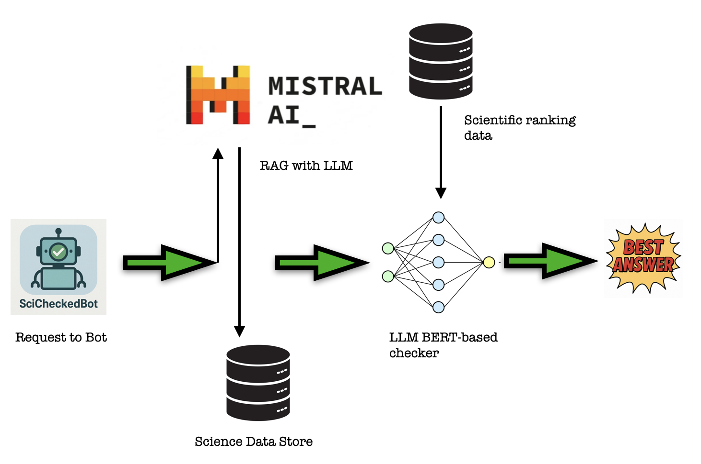

# Sci-checked-bot

This repository solves the problem of ranking LLM responses with system based on
a finetuned BERT model. User sends request to Telegram bot which is a RAG with
Mstral tiny model with scientific base. Mistral generates 5 answers and then
they go to our LLM checker and it ranks them. User gets the best answer.



There is Makefile which makes running pipelines much easier

## Setup

To create and activate an enviroment do folowing steps:

```bash
make setup
```

```bash
make activate
```

If you want to delete your enviroment:

```bash
make clean
```

## Train

You can start training BERT model with MLFlow Logging on the local tracking
server by using provided commands:

1. **Activate MLFlow tracking server:**

```bash
make mlflow
```

2. **Download Data from Cloud Database:**

```bash
make download
```

3. **To start training pipeline:**

```bash
make train
```

Also you can use this command in the terminal to train without MLFLow:

```bash
python pl_scripts/pl_train.py \
  --config_name=config \
  --overrides=model.seed=42,model.num_train_epochs=10 \
  --logger=None
```

## Infer

**To start inference pipeline:**

```bash
make infer
```

## Production preparation

1. **Provide your Mistral and Telegram_Bot API keys in .env file You can
   contact** **me @dvachewski in telegram and I wil send you keys.**

2. **To run containers with Triton server with BERT model and with Telegram
   bot:**

```bash
make run_bot
```

After running this command you can ask @SciCheckedBot in the Telegram

**To deactivate containers:**

```bash
make down_bot
```
